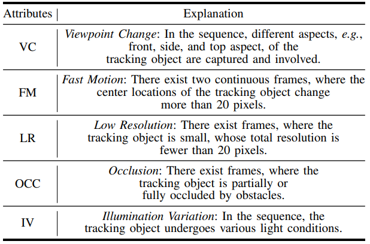

UAVDark135 is the very first UAV dark tracking benchmark dedicated to providing a comprehensive evaluation of tracking performance at night.

UAVDark135 consists of 135 sequences, most of which were shot by a standard UAV at night, including more than 125k manually annotated frames. The benchmark covers a wide range of scenes, e.g., road, ocean, street, highway, and lakeside, including a large number of objects, such as person, car, building, athlete, truck, and bike.

The benchmark is available [here](https://pan.baidu.com/s/1JcV_wTUSt9F8iBXiLCZQdQ) (password: axci).

### UAVDark135 Tracking Benchmark

#### A. Platform and Statistics

Standing as the first UAV dark tracking benchmark, the UAVDark135 contains totally 135 sequences captured by a standard UAV2 at night. The benchmark includes various tracking scenes, e.g., crossings, t-junctions, road, highway, and consists of different kinds of tracked objects like people, boat, bus, car, truck, athletes, house, etc. To extent the covered scenes, the benchmark also contains some sequences from YouTube, which were shot on the sea. The total frames, mean frames, maximum frames, and minimum frames of the benchmark are 125466, 929, 4571, and 216 respectively, making it suitable for large-scale evaluation. The videos are captured at a frame-rate of 30 frames/s (FPS), with the resolution of 1920×1080. 

#### B. Annotation

The frames in UAVDark135 are all manually annotated, where a sequence is completely processed by the same annotator to ensure consistency. Since in some dark scenes the object is nearly invisible, annotation process is much more strenuous. After the first round, 5 professional annotators carefully checked the results and made revision for several rounds to reduce errors as much as possible in nearly 2 months.

Since the boundary contour of the object is not obvious in the dark, the result boxes of the first annotation fluctuates in continuous image frames. However, the actual motion process of the object should be smooth. In these considerations, we record the original annotation every 5 frames for the sequence with extremely severe vibration, and the results of the remaining frames are obtained by linear interpolation, which is closer to the position and scale variation of the real object.

#### C. Attributes

For more details, please refer to our [paper](https://arxiv.org/abs/2101.08446).