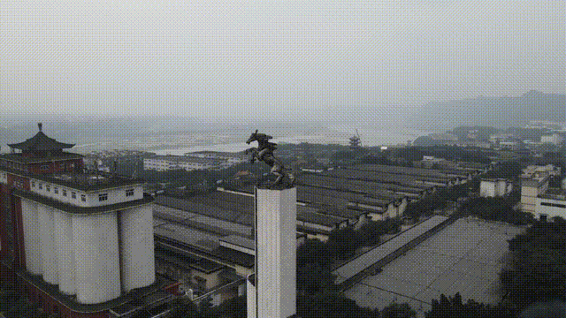

### Overview

Develop efficient and robust correlation filter (CF)-based trackers on CPU for UAV tracking in challenging scenarios. By mining temporal, spatial, and channel information properly, we have constructed several competitive tracking approaches while maintaining real-time performance on a single CPU.

---

### Papers with code

Related works are presented as follows:

- Introduced the temporal regularization based on **historical interval response inconsistency** and the **disruptor-aware** mechanism based on response bucketing into the CF framework, realizing competitive performance on several UAV tracking-specific benchmarks. <iframe src="https://ghbtns.com/github-btn.html?user=vision4robotics&repo=IBRI-tracker&type=star&count=true&size=medium" frameborder="0" scrolling="0" width="150" height="20" title="GitHub"></iframe>

   > [*Disruptor-Aware Interval-Based Response Inconsistency for Correlation Filters in Real-Time Aerial Tracking*](../../publication/2020_tgrs_ibri-tracker/) in **IEEE TRANSACTIONS ON GEOSCIENCE AND REMOTE SENSING**

- Proposed the **response deviation-aware regularization** and the **channel reliability aware regularization** to make full use of the crucial information in response maps and reliable channels. Experiments demonstrate the proposed MRCF's superiority in numerous challenging UAV tracking scenarios. Further, an original UAV self-localization system based on the proposed tracking approach is constructed. <iframe src="https://ghbtns.com/github-btn.html?user=vision4robotics&repo=MRCF-tracker&type=star&count=true&size=medium" frameborder="0" scrolling="0" width="150" height="20" title="GitHub"></iframe>

   > [*Multi-Regularized Correlation Filter for UAV Tracking and Self-Localization*](https://github.com/vision4robotics/MRCF-Tracker) in **IEEE Transactions on Industrial Electronics**

- Constructed a novel DCF-based tracker to enhance the sensitivity and resistance to mutations with an adaptive hybrid label. Considerable experiments on widely used UAV tracking benchmarks demonstrate its effectiveness. <iframe src="https://ghbtns.com/github-btn.html?user=vision4robotics&repo=MSCF-tracker&type=star&count=true&size=medium" frameborder="0" scrolling="0" width="150" height="20" title="GitHub"></iframe>

   > [*Mutation Sensitive Correlation Filter for Real-Time UAV Tracking with Adaptive Hybrid Label*](../../publication/2021_icra_mscf_tracker/) in **ICRA 2021**

- Proposed a scale-channel attention-based Siamese network for unmanned aerial manipulator (UAM) tracking, along with a pioneering UAM tracking benchmark. <iframe src="https://ghbtns.com/github-btn.html?user=vision4robotics&repo=SiamSA&type=star&count=true&size=medium" frameborder="0" scrolling="0" width="150" height="20" title="GitHub"></iframe>

   > [*Siamese Object Tracking for Vision-Based UAM Approaching with Pairwise Scale-Channel Attention*](../../publication/2022_iros_siampsa/) in **IROS 2022**

