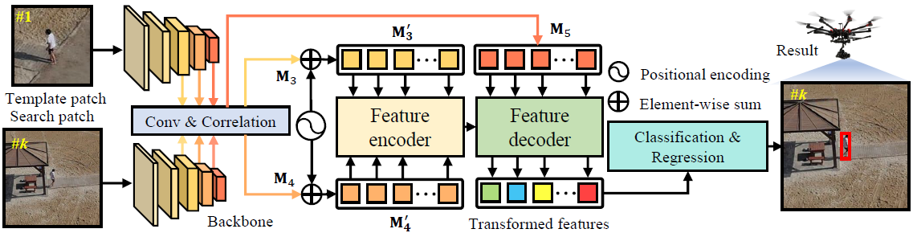
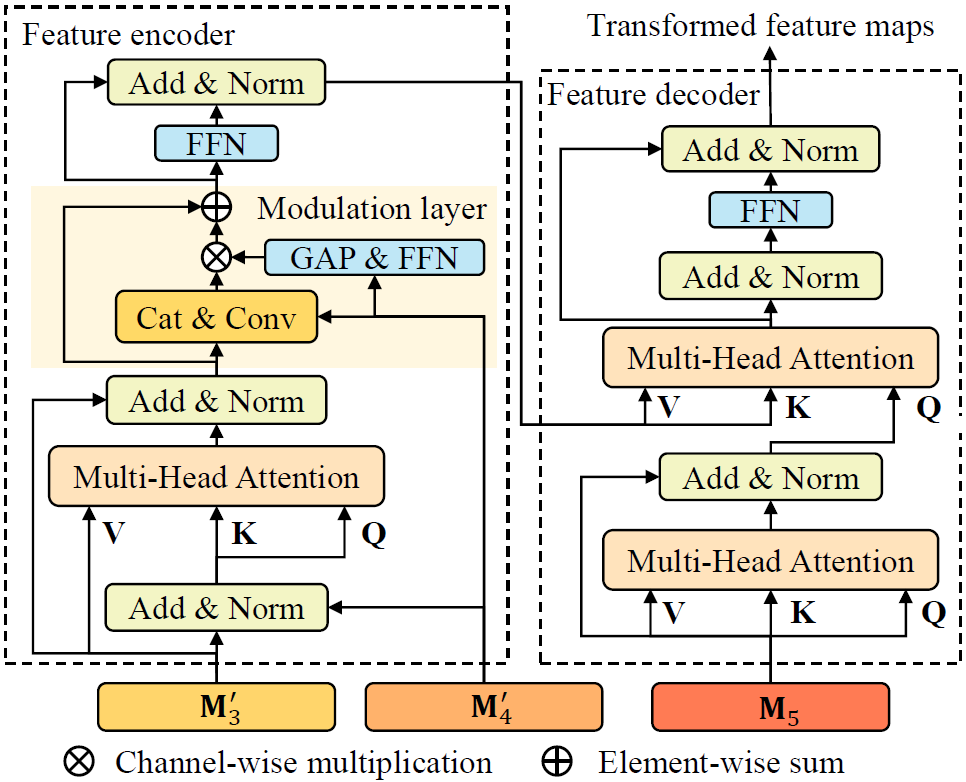

---
title: "HiFT: Hierarchical Feature Transformer for Aerial Tracking"
# subtitle: "ICCV, 2021."
authors:
- Ziang Cao
- Changhong Fu
- admin
- Bowen Li
- Yiming Li
date: "2021-07-22T00:00:00Z"
doi: ""

# Schedule page publish date (NOT publication's date).
publishDate: "2019-07-22T00:00:00Z"

# Publication type.
# Legend: 0 = Uncategorized; 1 = Conference paper; 2 = Journal article;
# 3 = Preprint / Working Paper; 4 = Report; 5 = Book; 6 = Book section;
# 7 = Thesis; 8 = Patent
publication_types: ["1"]

# Publication name and optional abbreviated publication name.
publication: In Proceedings of the IEEE/CVF International Conference on Computer Vision (ICCV), virtual, pp.15457-15466, 2021.
publication_short: In *ICCV2021*

abstract: Siamese-based visual tracking methods generally execute the classification and regression of the target object based on the similarity maps. However, existing works either solely employ a single map generated by the last convolutional layer which degrades the localization accuracy, or separately use multiple maps for decision making, introducing intractable computations for aerial mobile platforms. In this work, we propose an efficient and effective hierarchical feature transformer (HiFT) in Siamese tracking. Hierarchical similarity maps generated by multi-level convolutional layers are fed into a feature transformer network. Not only the global contextual information can be raised, facilitating the target search, but also our end-to-end architecture with the transformer can learn the inter-dependencies among multi-level features, and discover a tracking-tailored feature space with strong discriminability due to the interactive fusion of spatial (early layers) and semantics cues (deep layers). Comprehensive evaluations on aerial benchmarks have proven the effectiveness of HiFT, and the real-world tests on the aerial platform have validated its practicability and robustness with a real-time speed.

# Summary. An optional shortened abstract.
summary: 'ICCV2021. *Introduced the hierarchical feature transformer into the Siamese framework to achieve interactive fusion of spatial and semantic cues.*'

tags:
- Siamese network
- Real-time object tracking
- Unmanned aerial vehicles
- Transformer
featured: true

links:
#- name: Custom Link
#  url: http://example.org
url_pdf: https://ieeexplore.ieee.org/document/9710895
url_code: https://github.com/vision4robotics/HiFT
url_dataset: ''
url_poster: ''
url_project: ''
url_slides: ''
url_source: ''
url_video: ''

# Featured image
# To use, add an image named `featured.jpg/png` to your page's folder. 
image:
  caption: ""
  focal_point: ""
  preview_only: false

# Associated Projects (optional).
#   Associate this publication with one or more of your projects.
#   Simply enter your project's folder or file name without extension.
#   E.g. `internal-project` references `content/project/internal-project/index.md`.
#   Otherwise, set `projects: []`.
# projects:
# - internal-project

# Slides (optional).
#   Associate this publication with Markdown slides.
#   Simply enter your slide deck's filename without extension.
#   E.g. `slides: "example"` references `content/slides/example/index.md`.
#   Otherwise, set `slides: ""`.
# slides: example

# <!-- 

# 
# <small>Fig. 1 Overview of the HiFT tracker.</small>
# 
# <small>Fig. 2 Framework of the hierarchical feature transformer.</small>
# 
 -->
---