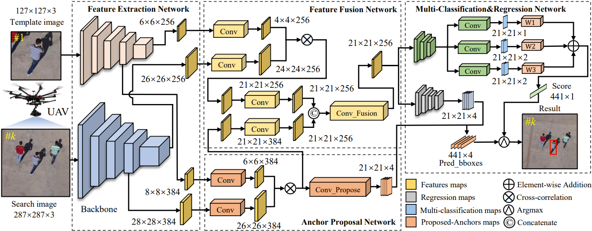

<small>The overview of SiamAPN tracker. It composes of four subnetworks, i.e., feature extraction network, feature fusion network, anchor proposal network (APN), and muti-classification®ression network.</small>

