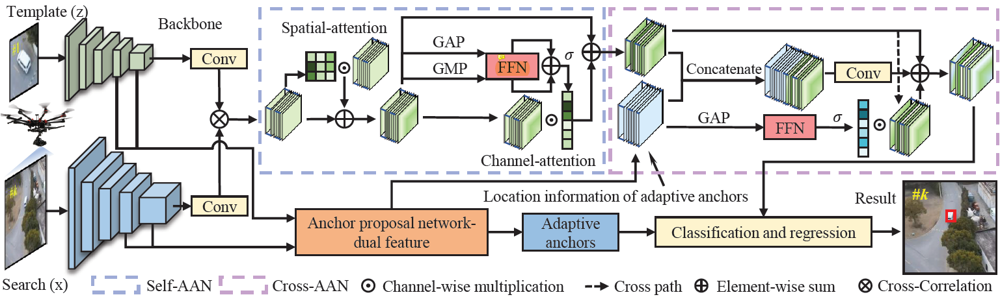

---
title: "SiamAPN++: Siamese Attentional Aggregation Network for Real-Time UAV Tracking"
authors:
- Ziang Cao
- Changhong Fu
- admin
- Bowen Li
- Yiming Li
date: "2021-06-30T00:00:00Z"
doi: ""

# Schedule page publish date (NOT publication's date).意思是网页将上线的时间
publishDate: "2021-06-30T00:00:00Z"

# Publication type.
# Legend: 0 = Uncategorized; 1 = Conference paper; 2 = Journal article;
# 3 = Preprint / Working Paper; 4 = Report; 5 = Book; 6 = Book section;
# 7 = Thesis; 8 = Patent
publication_types: ["1"]

# Publication name and optional abbreviated publication name.
publication: In Proceedings of the IEEE/RSJ International Conference on Intelligent Robots and Systems (IROS), Prague, Czech Republic, pp. 3086-3092, 2021. 
publication_short: "In *IROS2021*"

abstract: Recently, the Siamese-based method has stood out from multitudinous tracking methods owing to its state-of-the-art (SOTA) performance. Nevertheless, due to various special challenges in UAV tracking, e.g., severe occlusion, and fast motion, most existing Siamese-based trackers hardly combine superior performance with high efficiency. To this concern, in this paper, a novel attentional Siamese tracker (SiamAPN++) is proposed for real-time UAV tracking. By virtue of the attention mechanism, the attentional aggregation network (AAN) is conducted with self-AAN and cross-AAN, raising the expression ability of features eventually. The former AAN aggregates and models the self-semantic interdependencies of the single feature map via spatial and channel dimensions. The latter aims to aggregate the cross-interdependencies of different semantic features including the location information of anchors. In addition, the dual features version of the anchor proposal network is proposed to raise the robustness of proposing anchors, increasing the perception ability to objects with various scales. Experiments on two well-known authoritative benchmarks are conducted, where SiamAPN++ outperforms its baseline SiamAPN and other SOTA trackers. Besides, real-world tests onboard a typical embedded platform demonstrate that SiamAPN++ achieves promising tracking results with real-time speed.
# Summary. An optional shortened abstract.
summary: '**IROS2021.** *Integrated self-attention and cross-attention into the Siamese framework to enhanced the perception ability for various scale objects.*'

tags:
- Siamese network
- Visual tracking
- Unmanned aerial vehicles
featured: false

links:
#- name: Custom Link
#  url: http://example.org
url_pdf: https://ieeexplore.ieee.org/document/9636309
url_code: 'https://github.com/vision4robotics/SiamAPN'
url_dataset: ''
url_poster: ''
url_project: ''
url_slides: ''
url_source: ''
url_video: 'https://youtu.be/okS289p3pCQ'
# Featured image
# To use, add an image named `featured.jpg/png` to your page's folder. 
image:
  caption: ""
  focal_point: ""
  preview_only: false

# Associated Projects (optional).
#   Associate this publication with one or more of your projects.
#   Simply enter your project's folder or file name without extension.
#   E.g. `internal-project` references `content/project/internal-project/index.md`.
#   Otherwise, set `projects: []`.
# projects:
# - internal-project

# Slides (optional).
#   Associate this publication with Markdown slides.
#   Simply enter your slide deck's filename without extension.
#   E.g. `slides: "example"` references `content/slides/example/index.md`.
#   Otherwise, set `slides: ""`.
# slides: example

# <!-- 

# 
# <small>The overview of the SiamAPN++ tracker.</small> -->

---