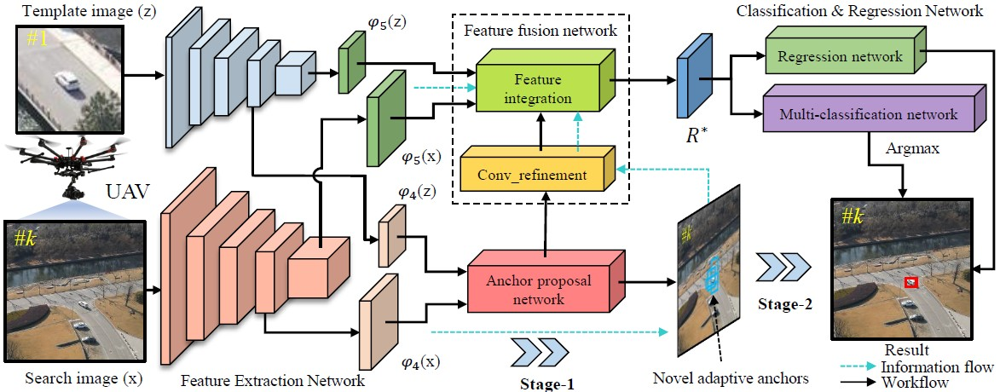

<small>The workflow of SiamAPN. It is composed of four subnetworks and two stages, i.e., feature extraction network, feature fusion network, anchor proposal network, and classification&amp;regression network. Stage-1 includes feature extraction network and anchor proposal network (APN). Stage-2 contains feature fusion network and classification&amp;regression network.</small>

