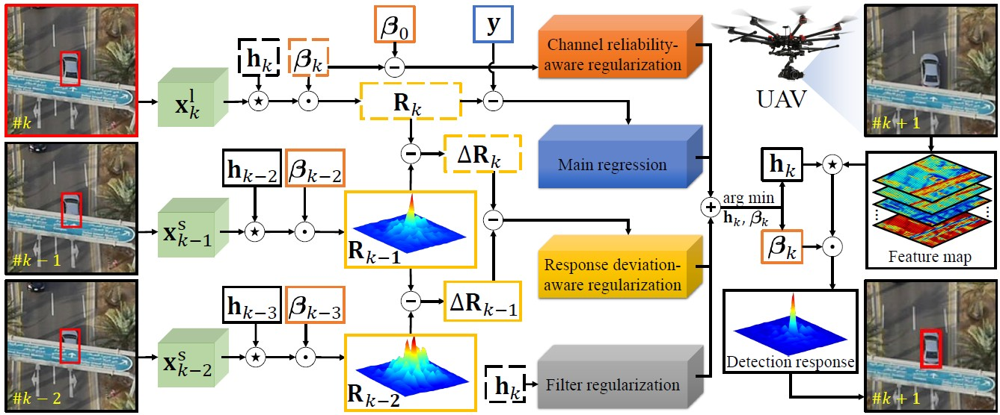

---
title: "Multi-Regularized Correlation Filter for UAV Tracking and Self-Localization"
authors:
- admin
- Changhong Fu
- Fuling Lin
- Fangqiang Ding
- Shan An
- Geng Lu
date: "2021-05-24T00:00:00Z"
doi: ""

# Schedule page publish date (NOT publication's date).
publishDate: "2021-05-24T00:00:00Z"

# Publication type.
# Legend: 0 = Uncategorized; 1 = Conference paper; 2 = Journal article;
# 3 = Preprint / Working Paper; 4 = Report; 5 = Book; 6 = Book section;
# 7 = Thesis; 8 = Patent
publication_types: ["2"]

# Publication name and optional abbreviated publication name.
publication: IEEE Transactions on Industrial Electronics, 2021. (JCR Q1, IF = 7.7)
publication_short: '*IEEE T-IE* (JCR Q1, IF = 7.7)'

abstract: As a sort of model-free tracking approach, discriminative correlation filter (DCF)-based trackers have shown prominent performance in unmanned aerial vehicle (UAV) tracking. Nevertheless, typical DCFs acquire all samples oriented to filter training merely from the current frame by cyclic shift operation in the spatial domain but ignore the consistency between samples across the timeline. The lack of temporal cues restricts the performance of DCFs under object appearance variations arising from object/UAV motion, scale variations, and viewpoint changes. Besides, many existing methods commonly neglect the channel discrepancy in object position estimation and generally treat all channels equally, thus limiting the further promotion of the tracking discriminability. To these concerns, this work proposes a novel tracking approach based on a multi-regularized correlation filter, i.e., MRCF tracker. By regularizing the deviation of responses and the reliability of channels, the tracker enables smooth response variations and adaptive channel weight distributions simultaneously, leading to favorable adaption to object appearance variations and enhancement of discriminability. Exhaustive experiments on five authoritative UAV-specific benchmarks validate the competitiveness and efficiency of MRCF against top-ranked trackers. Furthermore, we apply our proposed tracker to monocular UAV self-localization under air-ground robot coordination. Evaluations indicate the practicability of the presented method in UAV localization applications.
# Summary. An optional shortened abstract.
summary: 'IEEE T-IE (IF: 7.7). *Proposed the multi-regularized CF and constructed a visual tracking-based UAV self-localization system.*'

tags:
- Unmanned aerial vehicle (UAV)
- Model-free object tracking
- Multi-regularized correlation filter
- Vision-based UAV self-localization
featured: true

links:
#- name: Custom Link
#  url: http://example.org
url_pdf: https://ieeexplore.ieee.org/document/9457090
url_code: https://github.com/vision4robotics/MRCF-Tracker
url_dataset: ''
url_poster: ''
url_project: ''
url_slides: ''
url_source: ''
url_video: https://youtu.be/XzkreAPynE4

# Featured image
# To use, add an image named `featured.jpg/png` to your page's folder. 
image:
  caption: ""
  focal_point: ""
  preview_only: false

# Associated Projects (optional).
#   Associate this publication with one or more of your projects.
#   Simply enter your project's folder or file name without extension.
#   E.g. `internal-project` references `content/project/internal-project/index.md`.
#   Otherwise, set `projects: []`.
# projects:
# - internal-project

# Slides (optional).
#   Associate this publication with Markdown slides.
#   Simply enter your slide deck's filename without extension.
#   E.g. `slides: "example"` references `content/slides/example/index.md`.
#   Otherwise, set `slides: ""`.
# slides: example

# <!-- 

# 
# <small>Overall flowchart of the proposed MRCF.</small>
# 
 -->
---