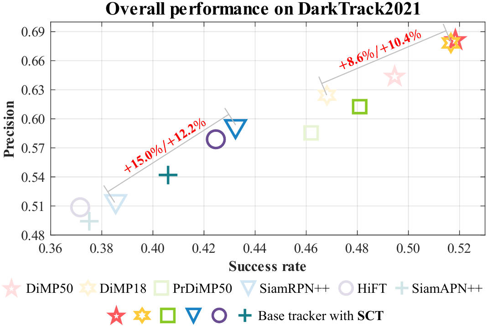

---
title: "Tracker Meets Night: A Transformer Enhancer for UAV Tracking"
authors:
- admin
- Changhong Fu
- Ziang Cao
- Shan An
- Guangze Zheng
- Bowen Li
date: "2022-01-03T00:00:00Z"
doi: ""

# Schedule page publish date (NOT publication's date).
publishDate: "2022-01-03T00:00:00Z"

# Publication type.
# Legend: 0 = Uncategorized; 1 = Conference paper; 2 = Journal article;
# 3 = Preprint / Working Paper; 4 = Report; 5 = Book; 6 = Book section;
# 7 = Thesis; 8 = Patent
publication_types: ["2"]

# Publication name and optional abbreviated publication name.
publication: IEEE Robotics and Automation Letters, 2022 (JCR Q2, IF = 5.2) with ICRA presentation.
publication_short: In *RA-L with ICRA2022*

abstract: Most previous progress in object tracking is realized in daytime scenes with favorable illumination. State-of-the-arts can hardly carry on their superiority at night so far, thereby considerably blocking the broadening of visual tracking-related unmanned aerial vehicle (UAV) applications. To realize reliable UAV tracking at night, a spatial-channel Transformer-based low-light enhancer (namely SCT), which is trained in a novel task-inspired manner, is proposed and plugged prior to tracking approaches. To achieve semantic-level low-light enhancement targeting the high-level task, the novel spatial-channel attention module is proposed to model global information while preserving local context. In the enhancement process, SCT denoises and illuminates nighttime images simultaneously through a robust non-linear curve projection. Moreover, to provide a comprehensive evaluation, we construct a challenging nighttime tracking benchmark, namely DarkTrack2021, which contains 110 challenging sequences with over 100K frames in total. Evaluations on both the public UAVDark135 benchmark and the newly constructed DarkTrack2021 benchmark show that the task-inspired design enables SCT with significant performance gains for nighttime UAV tracking compared with other top-ranked low-light enhancers. Real-world tests on a typical UAV platform further verify the practicability of the proposed approach.
# Summary. An optional shortened abstract.
summary: 'IEEE RA-L with ICRA2022. *Trained a spatial-channel transformer-based low-light enhancer in a novel task-related manner, to facilitate nighttime aerial tracking significantly.*'

tags:
- Unmanned aerial vehicle
- Nighttime tracking
- Low-light enhancement
- Transformer
featured: true

links:
#- name: Custom Link
#  url: http://example.org
url_pdf: https://ieeexplore.ieee.org/document/9696362
url_code: https://github.com/vision4robotics/SCT
url_dataset: https://darktrack2021.netlify.app/
url_poster: ''
url_project: ''
url_slides: ''
url_source: ''
url_video: https://www.youtube.com/watch?v=I1eZnJ_dbfg

# Featured image
# To use, add an image named `featured.jpg/png` to your page's folder. 
image:
  caption: ""
  focal_point: ""
  preview_only: false

# Associated Projects (optional).
#   Associate this publication with one or more of your projects.
#   Simply enter your project's folder or file name without extension.
#   E.g. `internal-project` references `content/project/internal-project/index.md`.
#   Otherwise, set `projects: []`.
# projects:
# - internal-project

# Slides (optional).
#   Associate this publication with Markdown slides.
#   Simply enter your slide deck's filename without extension.
#   E.g. `slides: "example"` references `content/slides/example/index.md`.
#   Otherwise, set `slides: ""`.
# slides: example

# <!-- 

# 
# <small>Overall performance of SOTA trackers with the proposed SCT enabled (markers in a dark color) or not (markers in a light color) in the newly constructed nighttime UAV tracking benchmark---DarkTrack2021. SCT significantly boosts the nighttime tracking performance of trackers in a plug-and-play manner.</small>
# 
 -->

---