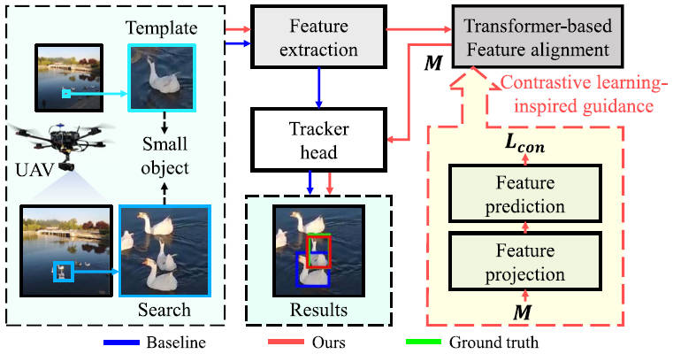

---
title: "Scale-Aware Domain Adaptation for Robust UAV Tracking"
authors:
- Changhong Fu
- Tenga Li
- admin
- Guangze Zheng
- Sihang Li
- Peng Lu
date: "2023-04-28T00:00:00Z"
doi: ""

# Schedule page publish date (NOT publication's date).
publishDate: "2023-04-28T00:00:00Z"

# Publication type.
# Legend: 0 = Uncategorized; 1 = Conference paper; 2 = Journal article;
# 3 = Preprint / Working Paper; 4 = Report; 5 = Book; 6 = Book section;
# 7 = Thesis; 8 = Patent
publication_types: ["2"]

# Publication name and optional abbreviated publication name.
publication: IEEE Robotics and Automation Letters, 2023 (JCR Q2, IF = 5.2).
publication_short: '*IEEE RA-L* (JCR Q2, IF = 5.2)'

abstract: Siamese object tracking has facilitated diversified applications for autonomous unmanned aerial vehicles (UAVs). However, they are typically trained on general images with relatively large objects instead of small objects observed from UAV. The gap on object scale between the training and inference phases is prone to suboptimal tracking performance or even failure. To solve the gap issue and tailor general Siamese trackers for UAV tracking, this work proposes a novel scale-aware domain adaptation framework, i.e., ScaleAwareDA. Specifically, a contrastive learning-inspired network is proposed to guide the training phase of Transformer-based feature alignment for small objects. In this network, feature projection module is designed to avoid information loss of small objects. Feature prediction module is developed to drive the aforementioned training phase in a self-supervised way. In addition, to construct the target domain, training datasets with UAV-specific attributes are obtained by downsampling general training datasets. Consequently, this novel training approach can assist a tracker to represent objects in UAV scenarios more powerfully and thus maintain its robustness. Extensive experiments on three authoritative challenging UAV tracking benchmarks have demonstrated the superior tracking performance of ScaleAwareDA. In addition, quantitative real-world tests further attest to its practicality.
# Summary. An optional shortened abstract.
# summary: 'IEEE RA-L with ICRA2022. *Trained a spatial-channel transformer-based low-light enhancer in a novel task-related manner, to facilitate nighttime aerial tracking significantly.*'

tags:
- Unmanned aerial vehicle
- Visual object tracking
- Transformer-based domain adaptation
- Contrastive learning-inspired training
featured: false

links:
#- name: Custom Link
#  url: http://example.org
url_pdf: https://ieeexplore.ieee.org/abstract/document/10111056
url_code: https://github.com/vision4robotics/ScaleAwareDA
url_dataset: ''
url_poster: ''
url_project: ''
url_slides: ''
url_source: ''
url_video: https://www.youtube.com/watch?v=mIunErVTXPI

# Featured image
# To use, add an image named `featured.jpg/png` to your page's folder. 
image:
  caption: ""
  focal_point: ""
  preview_only: false

# Associated Projects (optional).
#   Associate this publication with one or more of your projects.
#   Simply enter your project's folder or file name without extension.
#   E.g. `internal-project` references `content/project/internal-project/index.md`.
#   Otherwise, set `projects: []`.
# projects:
# - internal-project

# Slides (optional).
#   Associate this publication with Markdown slides.
#   Simply enter your slide deck's filename without extension.
#   E.g. `slides: "example"` references `content/slides/example/index.md`.
#   Otherwise, set `slides: ""`.
# slides: example

# <!-- 

# 
# <small>Overall performance of SOTA trackers with the proposed SCT enabled (markers in a dark color) or not (markers in a light color) in the newly constructed nighttime UAV tracking benchmark---DarkTrack2021. SCT significantly boosts the nighttime tracking performance of trackers in a plug-and-play manner.</small>
# 
 -->

---